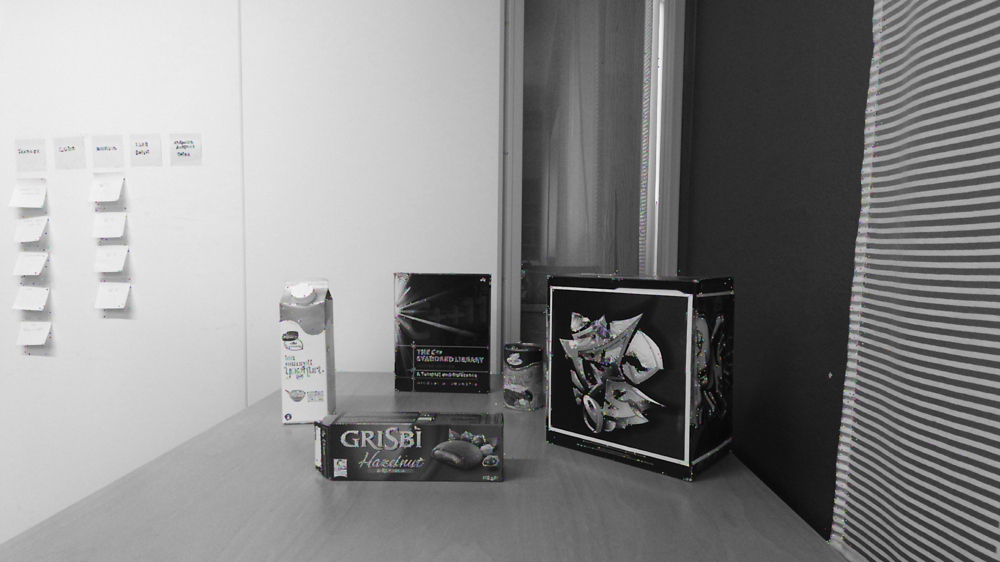
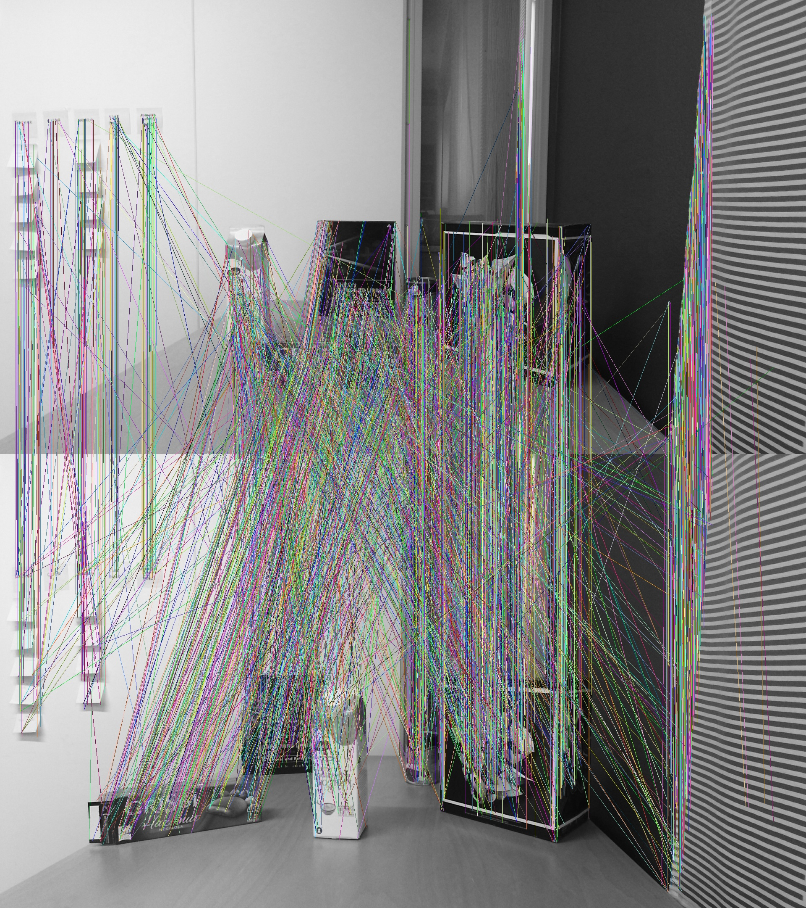

# CUDA-ORB
ORB (Oriented FAST and Rotated BRIEF) keypoints detection, descriptors computation and BF-matching by CUDA

# News

## News for V2.0

- Allocate memory for features separately to avoid misaligned memory bug while calculating hamming distance
- NMS keypoints after all octave detection completed
- Speed up Gaussian filter
- Speed up hamming matching

# Requirement

OpenCV, CUDA

# Result
Keypoints example:

Matching example:

OpenCV example:

# Speed

Repeat the matching test for 100 times on GTX 1080 and RTX 3090, and here are the results:

|  Device  | Version | Detection / Matching Speed (ms) |
| :------: | :-----: | :-----------------------------: |
| GTX 1080 |   1.0   |           3.71 / 3.28           |
| GTX 1080 |   2.0   |           3.21 / 1.08           |
| RTX 3090 |   1.0   |     (Misaligned memory bug)     |
| RTX 3090 |   2.0   |           1.74 / 0.18           |

# Reference

https://github.com/opencv/opencv

http://www.gwylab.com/download/ORB_2012.pdf
